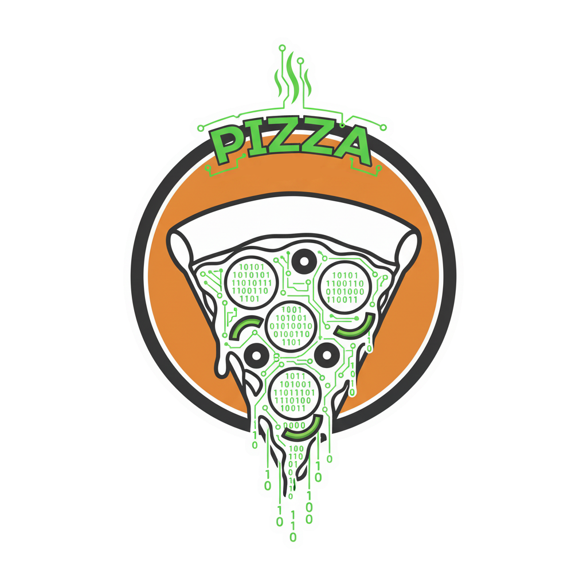

# Pizzeria optimization

> 🍕 This repository contains an optimization project focused on maximizing the efficiency and profitability of a pizzeria. Using operations research techniques, mathematical modeling, and Python programming, it tackles real-world constraints like ingredient availability, production capacity, and business goals. Explore how optimization models can be applied to the food industry to drive smarter decisions and better outcomes.

    

## Models that will be used to optimize the pizzeria
### Optimization Techniques
To maximize pizzeria profits, consider these optimization techniques:

1. Cost Analysis per Pizza:
- Calculate the cost of ingredients for each pizza.
- Factor in fixed costs (rent, utilities, etc.).

2. Profit per Pizza:
- Determine the profit margin for each pizza by subtracting costs from revenue.

3. Utility per Pizza:
- Analyze the overall profitability of each pizza, considering factors beyond just profit margin.

4. Best-Selling Pizza Analysis:
- Identify the top-selling pizzas during specific time periods (monthly, weekly, daily).
- Analyze sales data to determine peak sales times.

### Simulation Techniques
To model different pricing scenarios and their potential impact on sales, consider these simulations:

1. Peak Season Price Increase:
- Simulate increasing prices for popular pizzas during peak seasons.
- Analyze how this affects overall revenue and customer behavior.

2. Peak Season Price Decrease:
- Model the impact of decreasing prices for popular pizzas during peak seasons.
- Evaluate the trade-off between increased sales volume and reduced profit margin.

3. Promotional Pricing:
- Simulate offering promotions like "buy one, get one half-off" while increasing the price of individual pizzas.
- Assess the effectiveness of these promotions in driving sales and overall revenue.